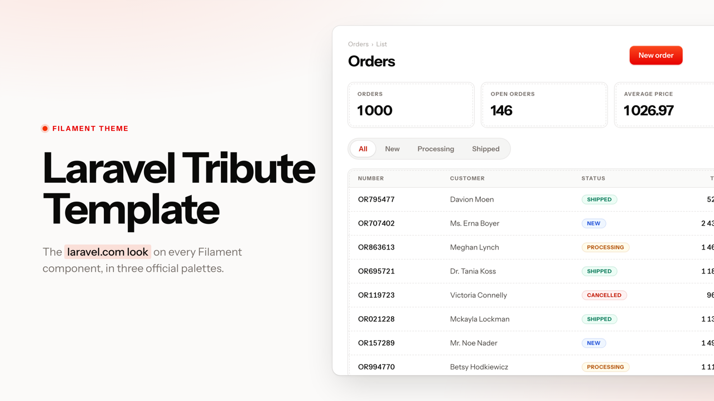

# Filament Laravel Tribute Template

**A free Filament v5 theme paying tribute to the laravel.com art direction.**

> Warm-neutral grays, double-frame surfaces, Instrument Sans typography and
> three brand palettes: Laravel, Forge and Cloud.

[](https://packagist.org/packages/laboiteacode/filament-laravel-tribute-template)
[](https://github.com/la-boite-a-code/filament-laravel-tribute-template/actions/workflows/run-tests.yml)
[](https://github.com/la-boite-a-code/filament-laravel-tribute-template/actions/workflows/phpstan.yml)
[](https://packagist.org/packages/laboiteacode/filament-laravel-tribute-template)
[](LICENSE.md)

First in a series of homage themes by
[La Boite à Code](https://laboiteacode.fr).



---

## Requirements

- PHP `^8.2`
- Laravel `^12.0`
- Filament `^5.0`
- Tailwind CSS `^4.0` (shipped with Filament v5)

---

## Installation

### 1. Pull the package

```bash
composer require laboiteacode/filament-laravel-tribute-template
```

### 2. Run the installer

```bash
php artisan laravel-tribute-template:install
```

This publishes:
- `config/filament-laravel-tribute-template.php` — optional env-driven palette default
- `resources/css/filament/admin/theme.css` — Filament panel theme entry-point

### 3. Wire the theme into your panel

Edit `app/Providers/Filament/AdminPanelProvider.php` and register both the
theme stylesheet and the plugin:

```php
use LaBoiteACode\LaravelTributeTemplate\Enums\Palette;
use LaBoiteACode\LaravelTributeTemplate\LaravelTributeTemplatePlugin;

public function panel(Panel $panel): Panel
{
    return $panel
        ->viteTheme('resources/css/filament/admin/theme.css')
        ->plugin(
            LaravelTributeTemplatePlugin::make()
                ->palette(Palette::Laravel),
        );
}
```

### 4. Build the assets

```bash
npm run build      # production
npm run dev        # development (HMR)
```

Reload the panel and the theme is live.

---

## Picking a palette

Three brand palettes ship out of the box. Each one registers a full shade
scale on the panel through Filament's own `->colors()`, so every component
follows it — no body class, no second copy of the scale.

```php
use LaBoiteACode\LaravelTributeTemplate\Enums\Palette;

LaravelTributeTemplatePlugin::make()->palette(Palette::Laravel) // #F53003 (default)
LaravelTributeTemplatePlugin::make()->palette(Palette::Forge)   // #02EAC2
LaravelTributeTemplatePlugin::make()->palette(Palette::Cloud)   // #0057FF
```

| Palette   | Brand colour | Grays   | Primary buttons               |
| --------- | ------------ | ------- | ----------------------------- |
| `laravel` | `#F53003`    | stone   | white text on red             |
| `forge`   | `#02EAC2`    | neutral | dark text on the bright green |
| `cloud`   | `#0057FF`    | slate   | white text on blue            |

The scales are hand-tuned rather than generated. Filament picks button,
badge and link shades by contrast, and a generated scale drifts away from
the brand: Laravel red turns pink, Forge green loses its dark text. Cards,
callouts, sidebar active states, focus rings, primary buttons, notification
dots and pagination chips all follow the chosen palette automatically.

Override individual slots on top of a palette:

```php
LaravelTributeTemplatePlugin::make()
    ->palette(Palette::Cloud)
    ->colors(['gray' => 'zinc', 'warning' => '#F59E0B']);
```

### Driving the palette from env

The plugin reads `config('filament-laravel-tribute-template.palette')` automatically when
`->palette()` is not called explicitly. Set the env var and the panel
follows — no extra wiring needed:

```dotenv
LARAVEL_TRIBUTE_TEMPLATE_PALETTE=cloud
```

Calling `->palette(Palette::Forge)` always wins over the env value.

---

## Plugin API

All options are fluent and can be chained on `LaravelTributeTemplatePlugin::make()`.

| Method | Purpose | Default |
| --- | --- | --- |
| `palette(Palette $palette)` | Pick the brand palette | `Palette::Laravel` |
| `font(?string $font)` | Override the panel font (`null` to leave Filament's choice) | `'Instrument Sans'` |
| `sidebarWidth(?string $width)` | Override the sidebar width (`null` to leave Filament's choice) | Filament's default |
| `maxContentWidth(bool\|string\|Width $value = true)` | `true` for full width, a `Width` case or preset string, or `false` to keep the panel's setting | `false` |
| `colors(array $colors)` | Override colour slots on top of the palette (Filament colour name, hex / `rgb()` / `oklch()` string, shade array, or a closure) | palette |
| `withoutColors()` | Skip colour injection entirely — keep the panel's `->colors()` untouched | enabled |

### Example — full configuration

```php
use Filament\Support\Colors\Color;
use LaBoiteACode\LaravelTributeTemplate\Enums\Palette;
use LaBoiteACode\LaravelTributeTemplate\LaravelTributeTemplatePlugin;

LaravelTributeTemplatePlugin::make()
    ->palette(Palette::Forge)
    ->font('Inter')
    ->sidebarWidth('18rem')
    ->maxContentWidth()
    ->colors([
        'primary' => '#7C3AED',
        'gray' => Color::Slate,
    ]);
```

---

## What the theme styles

Out of the box, LaravelTributeTemplate restyles every Filament v5 surface to match
the laravel.com art direction:

- **Sections & cards** — double-frame (inner border + canvas gap + outer
  hairline ring), generous padding, soft 8px radius
- **Tables** — flat header band, hairline row dividers, primary-tinted hover,
  refined pagination
- **Forms** — inputs with red required marks, focus glow, fieldset framing,
  reactive validation states
- **Notifications** — toasts with severity-tinted left edge; database panel
  reads as a clean list with the unread dot in primary color
- **Sidebar** — tinted gradient active state with a primary edge bar,
  primary-filled badges on the current item, group titles with refined
  tracking; the active treatment auto-simplifies to a colored icon when
  the sidebar is collapsed to icons-only
- **Modals** — header/content/footer mirror the section structure for
  visual consistency
- **Buttons** — solid primary, ghost gray, focus glow at the panel's primary
- **Tabs** — segmented pill on contained tabs, underlined inline tabs
- **Page headers** — bold display titles with a primary-colored period accent

A subtle radial gradient is painted on the body canvas so sections lift off
the page without needing a hard background fill.

---

## Customizing tokens

LaravelTributeTemplate exposes a handful of CSS custom properties so you can tweak
geometry without rewriting selectors. Add overrides in your panel's theme
CSS, **after** the package import:

```css
@import '../../../../vendor/filament/filament/resources/css/theme.css';
@import '../../../../vendor/laboiteacode/filament-laravel-tribute-template/resources/css/index.css';

/* Your overrides */
:root {
    --ltt-radius-sm: 0.25rem;     /* tighter buttons */
    --ltt-radius:    0.625rem;    /* softer cards */
    --ltt-frame-gap: 4px;         /* wider double-frame gap */
}

.dark {
    --ltt-frame-ring-color: oklch(0.30 0.005 75);
}
```

Available tokens:

| Token | Role |
| --- | --- |
| `--ltt-radius-xs` / `-sm` / `--ltt-radius` / `-lg` | Corner radius scale |
| `--ltt-pill` | Pill radius (badges, segmented tabs) |
| `--ltt-stroke` | Default border thickness |
| `--ltt-border-soft-light` / `-dark` | Hairline divider colour, per mode |
| `--ltt-canvas` | Body canvas colour |
| `--ltt-frame-gap` | Gap between inner border and outer ring |
| `--ltt-frame-gap-color` | Gap fill colour (defaults to canvas) |
| `--ltt-frame-ring-color` | Outer ring colour |
| `--ltt-shadow-sm` / `--ltt-shadow-lg` | Elevation scale |
| `--ltt-glow-mix` | Focus glow intensity (0–100%) |
| `--ltt-duration-slow` | Motion timings |
| `--ltt-ease-out` | Motion curve |


---

## How the theme hooks into Filament

The stylesheet only uses mechanisms Filament ships, so it survives Filament
updates and stays overridable:

- **Colours** are read from the panel palette through Filament's own
  variables (`--primary-500`, `--gray-200`, `--danger-600`, and `--color-*`
  inside coloured components). Change the palette and the whole theme
  follows.
- **Fonts** come from `->font()`, the **sidebar width** from
  `->sidebarWidth()`. Nothing is hard-coded.
- **Every `.fi-*` selector** is checked against the installed Filament
  sources by `tests/ThemeCssTest.php`, which fails if the theme targets a
  class Filament does not render.

---

## How it's compiled

LaravelTributeTemplate ships only source CSS — no precompiled bundle. The host
app's Vite/Tailwind pipeline picks up the package's
`resources/css/index.css` through the theme entrypoint published to
`resources/css/filament/admin/theme.css`, alongside Filament's own theme
import. That keeps Tailwind's `@source` scanning aware of both your panel
classes and the package's selectors, so unused utilities are pruned in
your build like any other dependency.

---

## Credits

- Built on top of [`filamentphp/plugin-skeleton`](https://github.com/filamentphp/plugin-skeleton).
- Maintained by [La Boite à Code](https://laboiteacode.fr).

---

## License

MIT — see [LICENSE.md](./LICENSE.md).
